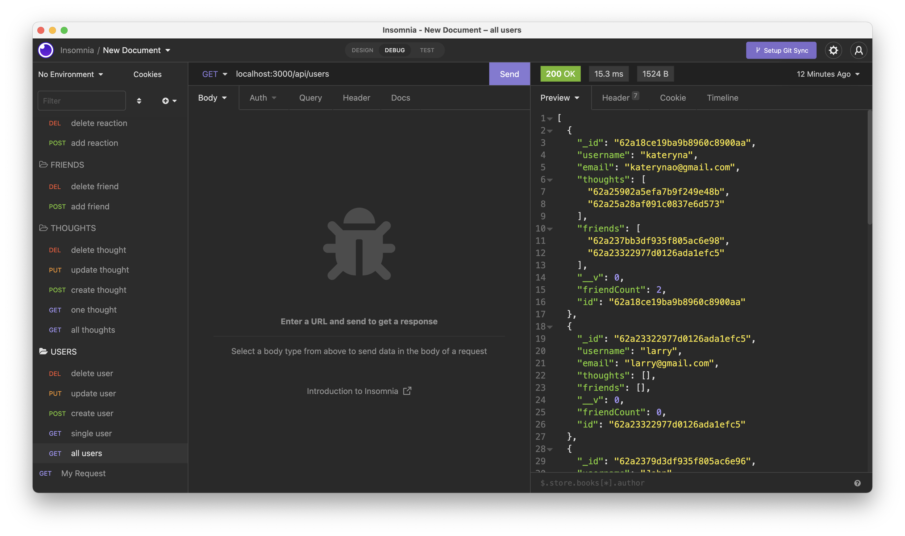
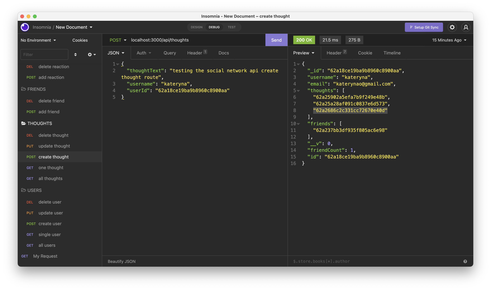
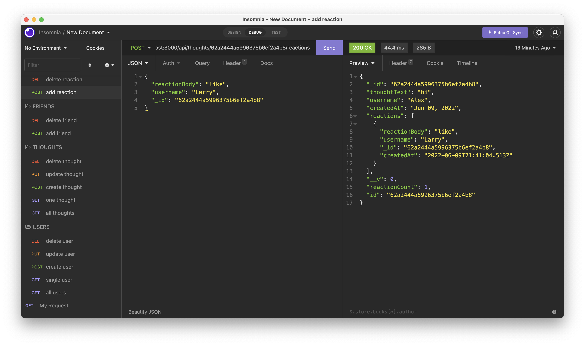

# Social Network API

## Description

Building and structuring an API using Express.js for routing and MongoDB, so that users can share their thoughts, react to friends’ thoughts, and create a friend list.

## Table of Contents
* [Installation](#installation)
* [Usage](#usage)
* [License](#license)
* [Author](#author)

## Installation 

Once you've cloned the repo,
- Run ```npm i``` to install dependencies
- Run ```npm run start``` to launch the application

## Usage 

Watch all routes being tested in the video provided 
*[Click for a video walkthrough](https://drive.google.com/file/d/16WVRRA9FG5HDSP63DiN61SUu-SN8dhSU/view)

The following screenshot shows GET route to return all users


The following screenshot shows POST route to create a thought


The following screenshot shows POST route to create a reaction


## License

[](https://opensource.org/licenses/MIT)
## Author

My file repository in GitHub is [here](https://github.com/KaterynaTekmenzhi/social-network-api)

